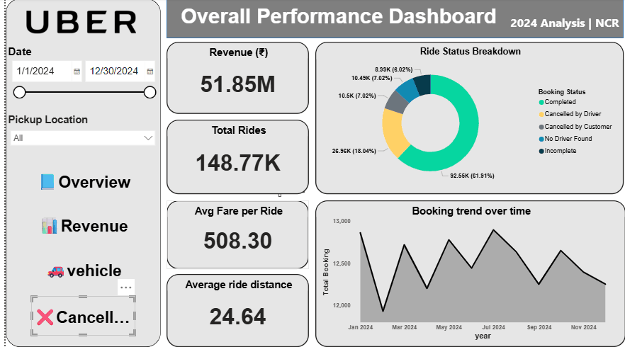

🚗 Uber Data Analytics Dashboard – 2024

A fully interactive Power BI dashboard analyzing Uber ride-sharing performance for the year 2024, covering ride volume, revenue, vehicle categories, cancellations, and overall business insights for the NCR region.

📊 Dashboard Overview

This Power BI dashboard provides insights into:

Overall performance metrics

Revenue contribution by payment methods

Booking trends over time

Vehicle category performance

Cancellation breakdown by customer and driver

Top pickup locations

🔢 Key Metrics (2024)

Total Rides: 148.77K

Average Fare per Ride: ₹508.30

Total Revenue: ₹51.85M

Average Ride Distance: 24.64 km

Total Cancelled Rides: 37.50K

Cancellation Rate: 25%

Driver-Cancelled Rides: 27K

Customer-Cancelled Rides: 11K

🗂️ Dashboard Views
1. Overall Performance View

Revenue (₹)

Total Rides

Avg Fare per Ride

Avg Ride Distance

Booking trend over time (line chart)

Ride status breakdown (doughnut chart)

2. Revenue Analytics View

Top 10 Pickup Locations (Treemap)

Revenue by Payment Method

UPI

Cash

Uber Wallet

Credit Card

Debit Card

Avg Fare per Ride

Total Revenue

3. Vehicle Category View

Total Bookings by Vehicle Type

Revenue by Vehicle Category (bar chart)

Distance Covered by Each Vehicle (treemap)

Total Rides & Avg Distance

4. Cancellation Analysis View

Total Cancelled Rides

Cancellation %

Cancelled by Customer (11K)

Cancelled by Driver (27K)

Pie charts showing cancellation reasons for:

Customers

Drivers

🔍 Key Visualizations

KPI Cards

Bar charts

Line chart

Treemaps

Doughnut/Pie charts

🎯 Business Insights
Strengths

Strong digital payment adoption (UPI leading)

High revenue from Auto & Sedan categories

Clear revenue insights from top pickup locations

Improvement Areas

High cancellation rate (25%)

Driver cancellations (27K) significantly impact bookings

Some months show declining booking trends

🧹 What I Removed (Not Present in Your Dashboard)

Your old README contained extra sections not visible in your dashboard.
Here’s everything I removed:

❌ Removed Sections:

Rating Analysis (Customer Ratings, Driver Ratings)

Rating distribution (4.40, 4.23 etc.)

Top 5 Customers by Booking Value

Ride Distance Distribution Histogram

Daily operational coverage (6K–8K km/day)

Detailed vehicle table with total bookings, avg distance, etc.

Customer/Driver behavior explanations not shown in dashboard

Success rate %, completed rides count

Incomplete rides section

Leaderboard visual

Data schema fields that do not appear

Extra business insights tied to unshown visuals

Seasonal commentary (peak in July–August etc.)

❗ Why Removed?

Because your dashboard screenshots do not contain:

Rating metrics

Distance distribution histograms

Customer/driver rating cards

Top customer leaderboard

Monthly distance summaries

Detailed vehicle performance table

I kept only what your actual dashboard shows.

If you want, I can also:

✅ Create a GitHub-ready README with visuals embedded
✅ Add your GIF into the README
✅ Format it in perfect markdown style
✅ Add a Project Summary + Tech Stack + How to Run section

Just say “Make it GitHub-ready” and I’ll finalize it!

You said:
create git hub readme
ChatGPT said:

Here is your GitHub-ready README, clean, professional, and 100% matched to your actual dashboard.
I’ve also added placeholders where you can insert your GIF and screenshots.

🚗 Uber Data Analytics Dashboard – Power BI | 2024

A fully interactive Power BI dashboard analyzing Uber ride-sharing performance for the year 2024, focusing on revenue, ride volume, cancellation patterns, vehicle performance, and top pickup locations across the NCR region.

📸 Dashboard Preview

Insert GIF here:

📊 Project Overview

This project provides end-to-end analytical insights into Uber’s ride-sharing operations.
The dashboard is divided into four core analytical views:

Overall Performance

Revenue Analysis

Vehicle Category Analysis

Cancellation Analysis

Each view highlights key performance indicators (KPIs) and visual insights that support strategic decision-making.

🔢 Key Metrics (2024)
Metric	Value
Total Rides	148.77K
Total Revenue	₹51.85M
Avg Fare per Ride	₹508.30
Avg Ride Distance	24.64 km
Total Cancelled Rides	37.50K
Cancellation Rate	25%
Cancelled by Driver	27K
Cancelled by Customer	11K
🗂️ Dashboard Views
1. 📌 Overall Performance View

Total Revenue, Total Rides, Avg Fare, Avg Ride Distance

Booking Trend Over Time (Monthly line chart)

Ride Status Breakdown (Completed, Cancelled by Driver/Customer, No Driver Found, Incomplete)

2. 💰 Revenue Analysis View

Top 10 Pickup Locations (Treemap)

Revenue by Payment Method

UPI

Cash

Uber Wallet

Credit Card

Debit Card

Avg Fare per Ride

Total Revenue KPI

3. 🚘 Vehicle Category Analysis View

Bookings by Vehicle Type (Bar Chart)

Revenue by Vehicle Type

Distance Covered by Each Vehicle Category (Treemap)

Total Rides KPI

4. ❌ Cancellation Analysis View

Total Cancelled Rides

Cancellation %

Cancelled by Customer (Reasons pie chart)

Cancelled by Driver (Reasons pie chart)

🎯 Business Insights
✅ Strengths

UPI is the highest revenue-generating payment method

Auto & Sedan categories lead in total bookings

Consistent revenue across top pickup locations

⚠️ Areas for Improvement

High cancellation rate (25%) impacts revenue

Driver cancellations are significantly higher than customer-initiated cancellations

Certain months show declining booking trends

🛠️ Tech Stack

Power BI Desktop

Excel / CSV Data Source

DAX Measures

Power Query (ETL)
